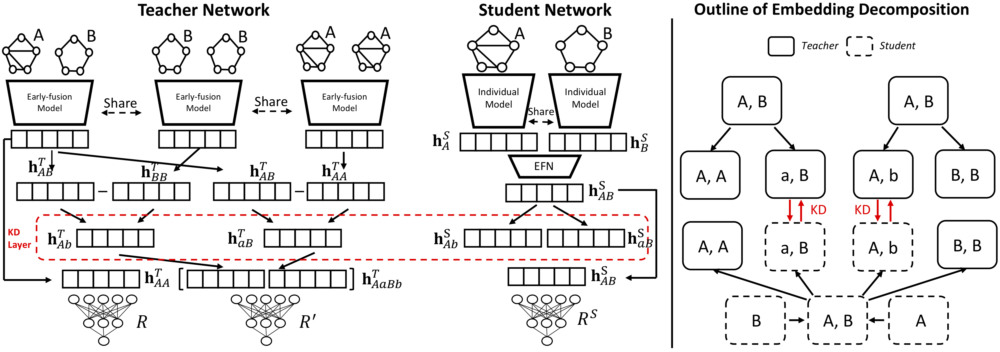

# Efficient Graph Similarity Computation - KD Model



## Train & Test with KD
If you run the experiment on AIDS, then
```
python src/main_kd.py --dataset AIDS700nef --gnn-operator gin --epochs 6000 --batch-size 128 --learning-rate 0.001
```
If you run the experiment on LINUX, then
```
python src/main_kd.py --dataset LINUX --gnn-operator gin --epochs 6000 --batch-size 128 --learning-rate 0.001
```
If you run the experiment on IMDB, then
```
python src/main_kd.py --dataset IMDBMulti --gnn-operator gin --epochs 6000 --batch-size 128 --learning-rate 0.001
```
If you run the experiment on ALKANE, then
```
python src/main_kd.py --dataset ALKANE --gnn-operator gin --epochs 6000 --batch-size 128 --learning-rate 0.001
```
, or run experiments on all scenarios.
```
bash train_kd.sh
```

## Train & Test with Non-KD (Student Only)
If you run the experiment on AIDS, then
```
python src/main_nonkd.py --dataset AIDS700nef --gnn-operator gin --epochs 6000 --batch-size 128 --learning-rate 0.001
```
If you run the experiment on LINUX, then
```
python src/main_nonkd.py --dataset LINUX --gnn-operator gin --epochs 6000 --batch-size 128 --learning-rate 0.001
```
If you run the experiment on IMDB, then
```
python src/main_nonkd.py --dataset IMDBMulti --gnn-operator gin --epochs 6000 --batch-size 128 --learning-rate 0.001
```
If you run the experiment on ALKANE, then
```
python src/main_nonkd.py --dataset ALKANE --gnn-operator gin --epochs 6000 --batch-size 128 --learning-rate 0.001
```
, or run experiments on all scenarios.
```
bash train_nonkd.sh
```