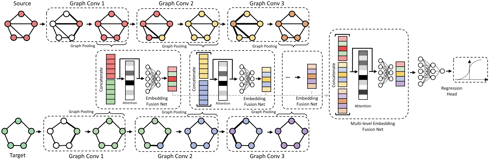

# Efficient Graph Similarity Computation - Teacher Model



## Train & Test
If you run the experiment on AIDS, then
```
python src/main.py --dataset AIDS700nef --gnn-operator gin --epochs 6000 --batch-size 128 --learning-rate 0.001
```
If you run the experiment on LINUX, then
```
python src/main.py --dataset LINUX --gnn-operator gin --epochs 6000 --batch-size 128 --learning-rate 0.001
```
If you run the experiment on IMDB, then
```
python src/main.py --dataset IMDBMulti --gnn-operator gin --epochs 6000 --batch-size 128 --learning-rate 0.001
```
If you run the experiment on ALKANE, then
```
python src/main.py --dataset ALKANE --gnn-operator gin --epochs 6000 --batch-size 128 --learning-rate 0.001
```
, or run experiments on all scenarios.
```
bash main.sh
```
